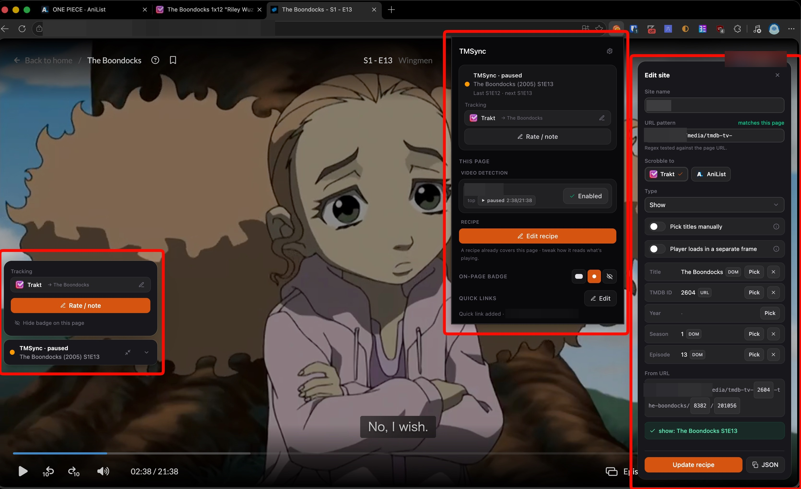
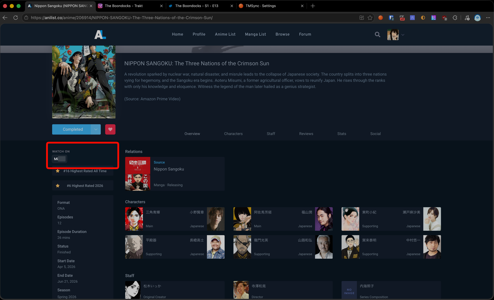

  
  <h1>TMSync</h1>
  

    <a href="https://chromewebstore.google.com/detail/tmsync/hkfpacmhbiccimikfleemmhfemdnjfpf"><b>Install for Chrome</b></a>
    &nbsp;·&nbsp;
    <a href="https://addons.mozilla.org/en-US/firefox/addon/tmsync/"><b>Install for Firefox</b></a>
  

Automatically scrobble what you watch to your media trackers, on any streaming site. TMSync is
multi-tracker by design. Today it supports [Trakt](https://trakt.tv),
[AniList](https://anilist.co), [MyAnimeList](https://myanimelist.net), and
[Simkl](https://simkl.com), with room for more.

TMSync is a browser extension for Chrome and Firefox. While you watch on a streaming site it
reads what's playing, finds it on the right tracker, and logs it for you. No manual check-ins.
It also works on aggregator sites that don't have an official app or API, which most trackers
can't touch.

Each thing you watch is routed to the trackers that fit it:

| You watch | It goes to |
|---|---|
| Movies and live-action TV | Trakt and/or Simkl |
| Anime series | Any of Trakt, AniList, MyAnimeList, and Simkl, all at once if you like |

You choose which trackers are on for each site. If you know MAL-Sync for anime, this is the same
idea, made general across trackers.

<table>
  <tr>
    <td width="50%" align="center">
      
       Passive scrobbling with the on-page badge, plus the point-and-click site editor.
    </td>
    <td width="50%" align="center">
      
       "Watch on" quick links injected onto Trakt and AniList pages.
    </td>
  </tr>
</table>

## What it does

- Detects the title and episode when you press play and records it to the right tracker. Trakt
  and Simkl update in real time, so your profile shows what you're currently watching. AniList
  and MyAnimeList get one list update per episode, once you pass the point where it counts as
  watched.
- Works on most sites with a video and a readable title, including ones with no API.
- Lets you add a new site yourself with a point-and-click picker, like an ad blocker's element
  picker. No code.
- Got the wrong match? Click the badge, search the tracker, pick the right one. It remembers the fix.
- Rate what you watch and keep a private note per item, synced back to your tracker (Simkl
  takes ratings only).
- Asks before it touches a finished series. Watching a completed anime again shows a
  "Rewatching?" prompt first, and TMSync never lowers the progress you already have.
- Adds "watch on..." links to trakt.tv and anilist.co pages that take you to your usual streaming
  sites at the right episode.
- Backs up your sites, quick links, and corrections to a file, and exports your Trakt movie
  history to Letterboxd as a CSV.
- Your watch history only goes to your own tracker accounts. Matching and scrobbling happen on
  your machine, and each item goes only to the trackers it's routed to.
- Only gets access to a site once you enable it there. No broad permissions at install.

## Getting started

1. Install it from the
   [Chrome Web Store](https://chromewebstore.google.com/detail/tmsync/hkfpacmhbiccimikfleemmhfemdnjfpf)
   or [Firefox Add-ons](https://addons.mozilla.org/en-US/firefox/addon/tmsync/).
2. Click the toolbar icon and connect the trackers you use: Trakt, AniList, MyAnimeList, Simkl,
   or any mix. MyAnimeList asks for access to myanimelist.net when you connect it.
3. Open something to watch on a streaming site and turn TMSync on for it under "Video detection"
   in the popup. A small badge shows what it matched. Press play.
4. On a site nobody has added yet, click "Set up recipe" in the toolbar popup, point at the
   title and episode, and you're tracking it. Then share it from Options, under Contribute, so
   others get the site too.

## Contributing

Site definitions ("recipes") are crowdsourced, and code contributions are welcome. The fastest
way to add a site is the Contribute page in the extension's options: it opens a prefilled GitHub
issue, and a bot turns it into a pull request. No server, no account beyond GitHub. Everything
else, from hand-written recipes to running the code locally, is in
[`CONTRIBUTING.md`](./CONTRIBUTING.md).

For how the code works, start with [`docs/ARCHITECTURE.md`](./docs/ARCHITECTURE.md).

## Support & status

This is a hobby project, maintained in spare time on a best-effort basis, with no SLA and no
guarantees. Issues and PRs are read and appreciated, but may be answered slowly. If something's
broken or a site stopped matching, opening an issue with the details is the most useful thing you
can do.

Want to chat, ask a question, or request a site? Join the
[TMSync Discord](https://discord.gg/XCRsUnrJR).

<!--
  Chrome Web Store listing copy, kept here so it stays in sync.

  Short description (max 132 chars):
  Auto-scrobble what you watch to your trackers (Trakt, AniList, MyAnimeList, Simkl). Works on most streaming sites, no manual logging.

  Full description: the "What it does" + "Getting started" sections above.

  Host permission justification (optional host access, "*://*/*"):
  TMSync asks for access to one site at a time, only when the user turns it on. It needs
  access to a streaming site to read the title and episode that plays there. It also asks
  for access to myanimelist.net and api.myanimelist.net only when the user connects a
  MyAnimeList account, to sign in and to update that user's anime list. MyAnimeList's API
  does not allow calls from other origins without this access. No access is granted at
  install.
-->

## License

[GPL-3.0](./LICENSE). You're free to use, study, modify, and share it; derivative works must stay
open under the same license. TMSync talks only to your own Trakt, AniList, MyAnimeList, and
Simkl accounts and is not affiliated with or endorsed by Trakt, AniList, MyAnimeList, or Simkl.
